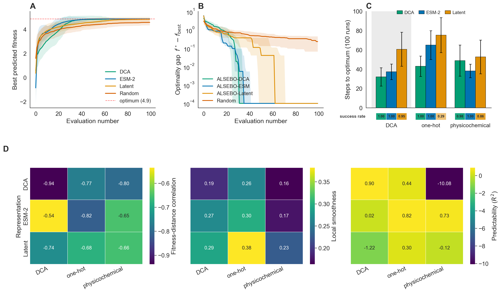
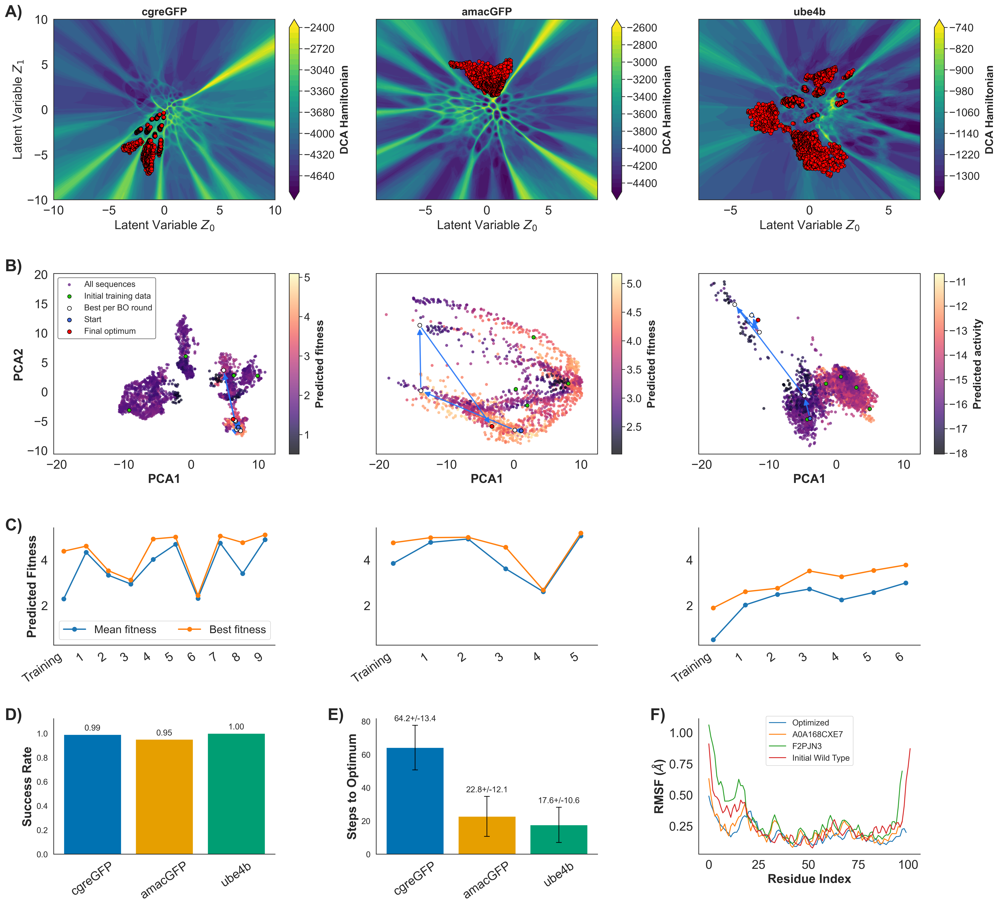
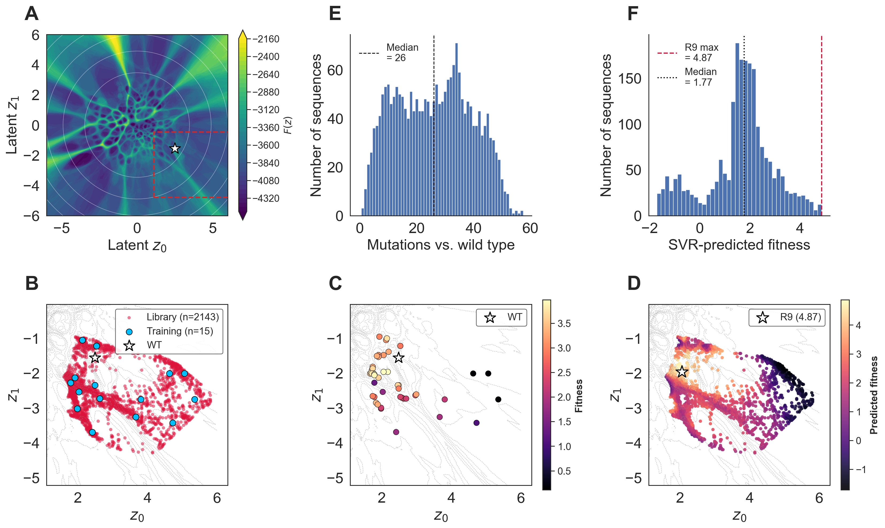

# ALSEBO

**Active Learning Sequence Exploration via Bayesian Optimization** — sample-efficient protein design by coupling generative sequence landscapes with coevolution-informed Bayesian optimization.

[](LICENSE.txt)
[](https://pyscaffold.org/)

Reference implementation for the manuscript *"ALSEBO: Sample-Efficient Protein Design by Coupling Generative Landscapes with Coevolution-Informed Bayesian Optimization."*


---

## Why ALSEBO

Protein engineering is limited less by *generating* variants than by the cost of *evaluating* them. A sequence of length *L* lives in a combinatorial space of size 20<sup>L</sup>, so navigating a fitness landscape under a tight evaluation budget demands feature representations that let a surrogate model learn fitness from very few examples.

ALSEBO is built on a single observation: **the coevolutionary Potts (DCA) Hamiltonian appears as a linear coordinate of the DCA feature vector.** Summing the per-residue DCA encoding across positions recovers the negative Hamiltonian exactly,

```
Σ_i f(x_i) = Σ_i h_i(x_i) + 2 Σ_{i<j} J_ij(x_i, x_j) = −2 H_DCA(x) − Σ_i h_i(x_i)
```

so the evolutionary signal that organizes the fitness landscape becomes directly accessible to a low-data Gaussian-process (GP) surrogate. The result is a funnel-like objective surface that a GP can navigate from a handful of measurements.

The framework couples a **generative latent sequence landscape** (a VAE prior combined with the DCA Hamiltonian into an effective score `F(z) = −log π_θ(z) + ⟨H_DCA⟩`) to **Bayesian optimization in feature space**, and operates with any user-defined objective.

---

## How it works

The pipeline runs in four model-agnostic stages, each replaceable:

1. **Generative sequence space** — train a VAE on a family MSA, sample a latent grid, decode a candidate library, and score it with a DCA Hamiltonian (`alsebo.VAE`, then your own decoding step).
2. **Featurization** — encode each sequence as DCA features (default), ESM-2 embeddings, or raw latent coordinates (`alsebo.seq_space`).
3. **Diversity-aware initialization** — pick a small, diverse training set via *k*-means centroids in t-SNE feature space (`alsebo.training_space`).
4. **BO / active-learning loop** — fit a GP, score candidates with a UCB acquisition function, evaluate the top-*k* batch against your objective, retrain, and repeat until convergence or budget exhaustion (`alsebo.optimizer`).

### Headline results (from the manuscript)

- On an **avGFP** benchmark against a virtual fluorescence oracle, ALSEBO recovers the oracle optimum — a nine-mutation, sfGFP-like variant (**R9**) — in **40–45 evaluations** from a **2,143-variant** library, robust to the initial budget (*T* = 5, 10, 15).
- **DCA features converge fastest** (31.1 ± 9.5 steps over 100 campaigns), ahead of ESM-2 (36.3 ± 8.1) and raw latent coordinates (59.7 ± 17.6); random search reaches the optimum 3% of the time.
- The advantage **survives representation-neutral oracles** (one-hot, physicochemical) and a non-DCA CNN objective, so it reflects the DCA feature geometry (FDC = −0.94), not the benchmark's construction.
- The framework **generalizes** to the GFP orthologs **cgreGFP** (~41% similarity) and **amacGFP** (~82%), and to a non-GFP enzyme, **Ube4b** (ubiquitin-ligase activity under a CNN objective), reaching predicted optima in tens of evaluations.

| | Feature benchmark | Generalization across families |
|---|---|---|
| |  |  |

---

## Installation

ALSEBO is a `src`-layout Python package (PyScaffold). Install in editable mode:

```bash
git clone https://github.com/dulithaprasanna/ALSEBO.git
cd ALSEBO
pip install -e .
```

This pulls the core dependencies declared in `setup.cfg`: `scikit-learn`, `pandas`, `numpy`, `matplotlib`, `seaborn`, `joblib`, `transformers`, `torch`, and the direct-coupling-analysis backend `dca` (`py-mfdca`, installed from git).

> **Note on the VAE module.** `alsebo.VAE` uses **TensorFlow/Keras**, which is not in `install_requires`. Install it separately (`pip install tensorflow`) if you intend to train the generative landscape. ESM-2 featurization additionally downloads `facebook/esm2_t30_150M_UR50D` via `transformers` on first use.

For development/testing:

```bash
pip install -e ".[testing]"
pytest        # or: tox
```

---

## Package layout

```text
src/alsebo/
├── seq_space.py        # Featurize a candidate library: DCA / ESM-2 / latent
├── training_space.py   # Diversity-aware k-means initialization
├── optimizer.py        # GP surrogate, UCB acquisition, BO batch selection
├── skeleton.py         # PyScaffold console-script template (not part of the pipeline)
└── VAE/                # TensorFlow VAE for the generative latent landscape
    ├── run_vae.py      #   CLI training entry point
    └── model/          #   model.py (VAE), layers.py (Sampling), generator.py (FASTA I/O)
```

### Core API

**`alsebo.seq_space`**

- `generate_seq_space(exp_dir, msa_fname, gen_seq_fasta_fname="generated_seqs.fasta", featuarization_method="DCA")` — featurize a generated library and write `seq_space.csv`. Methods: `"DCA"`, `"ESM"`, `"latent"`.
- `generate_dca_features(...)` / `compute_dca_features(...)` — per-residue DCA encoding `f(x_i) = h_i(x_i) + Σ_{j≠i} J_ij(x_i, x_j)`.
- `generate_esm_features(...)` — mean-pooled ESM-2 embeddings.
- `generate_latent_features(...)` — read VAE latent coordinates (z0, z1) from FASTA headers.

**`alsebo.training_space`**

- `sample_initial_training_sequnces(exp_dir, training_seq_size, manipold="TSNE")` — pick diverse cluster-centroid seeds, write `training_seqs.csv`.
- `generate_sequence_training_file(exp_dir, obj_config, obj_values)` — attach measured objective values and seed `seq_exp_data.csv`.

**`alsebo.optimizer`**

- `read_seq_files(exp_dir, obj_config)` — load training data and the remaining candidate pool.
- `gpr(x_train, y_train)` — fit per-objective GP regressors (Matérn ν=2.5 + White kernel; single- and multi-objective).
- `seq_space_prediction(models, x_space)` → `(mean, std)` per objective.
- `acquisition_function(preds, obj_config, strategy="UCB", beta=2.0)` — UCB with linear scalarization across objectives; min/max handled per objective.
- `get_next_seq_bo(seq_ids, obj_config, preds, top_k=5)` — select the next batch.
- `save_next_batch_results(...)` — append evaluated batch to `seq_exp_data.csv`.

### Conventions

- An `exp_dir` is a working directory holding the campaign's CSVs: `seq_space.csv` (candidates × features), `training_seqs.csv` (initial seeds), and `seq_exp_data.csv` (the growing training set with objective columns).
- `obj_config` is a dict, e.g. `{'names': ['fitness'], 'directions': ['max'], 'weights': [1.0]}`.

---

## Quick start

```python
from alsebo.seq_space import generate_seq_space
from alsebo.training_space import sample_initial_training_sequnces, generate_sequence_training_file
from alsebo.optimizer import (
    read_seq_files, gpr, seq_space_prediction,
    get_next_seq_bo, save_next_batch_results,
)

exp_dir = "campaign/"
obj_config = {"names": ["fitness"], "directions": ["max"], "weights": [1.0]}
batch_size = 5

# 1. Featurize a VAE-generated library (writes seq_space.csv)
generate_seq_space(exp_dir, "family.fasta", featuarization_method="DCA")

# 2. Diversity-aware initial training set (writes training_seqs.csv)
sample_initial_training_sequnces(exp_dir, training_seq_size=15)

# 3. Evaluate the seeds with YOUR objective and seed seq_exp_data.csv
#    obj_values is a list of [value] rows aligned to training_seqs.csv
generate_sequence_training_file(exp_dir, obj_config, obj_values)

# 4. Active-learning loop
for cycle in range(20):
    x_train, y_train, x_space, seq_ids = read_seq_files(exp_dir, obj_config)
    models = gpr(x_train, y_train)
    preds = seq_space_prediction(models, x_space)
    next_seqs, scores, idx = get_next_seq_bo(seq_ids, obj_config, preds, top_k=batch_size)

    # Evaluate the selected batch with your oracle / assay → new_values
    save_next_batch_results(exp_dir, next_seqs, idx, x_space, obj_config, new_values)
```

The objective in step 3/4 is fully user-defined — an experimental assay, a trained regressor (e.g. a DCA-SVR digital twin), or a sequence–function neural network. Worked, paper-grade campaigns (avGFP, cgreGFP, amacGFP, Ube4b) and the figure-generation scripts live in the manuscript's companion data repository.

---

## Training the generative landscape

The VAE learns a 2D latent space over one-hot MSA columns (encoder/decoder hidden widths scaled to sequence length, ReLU, batch norm, reparameterized Gaussian sampling, early stopping):

```bash
cd src/alsebo/VAE
python run_vae.py  <input.fasta>  <model_save_path>  <log_dir>
```

Decode a uniform grid of latent coordinates and score each decoded sequence with the DCA Hamiltonian to build the latent generative landscape (LGL) used as ALSEBO's candidate space.



---

## Caveats

- All validation in the manuscript is computational; MD evidence reports *structural correlates* of fluorescence, not photophysical measurements.
- DCA's single-coordinate concentration assumes a deep, well-sampled MSA. For shallow-MSA families where couplings are poorly estimated, fall back to ESM-2 embeddings despite their higher dimensionality.
- The multi-objective machinery (linear scalarization) is implemented but, in the manuscript, exercised only with a single objective; it cannot recover non-convex Pareto fronts.

## License

MIT — see [LICENSE.txt](LICENSE.txt). Contributions welcome; see [CONTRIBUTING.rst](CONTRIBUTING.rst).
