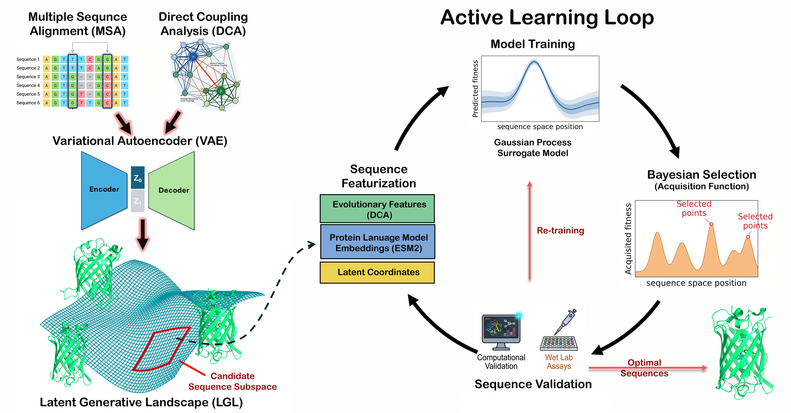

======
ALSEBO
======

**Active Learning Sequence Exploration via Bayesian Optimization**

ALSEBO is a Python framework for navigating protein sequence space using a
closed-loop active learning strategy. It combines a Variational Autoencoder
(VAE) that generates a continuous latent landscape of sequences with
Bayesian Optimisation (BO) to iteratively propose the most promising
candidates for experimental testing.

Pipeline overview
=================

   Closed-loop active learning pipeline: a VAE-derived latent landscape
   feeds sequence selection, evaluation, and Bayesian optimisation, which
   in turn proposes the next batch of sequences.

.. code-block:: text

    MSA
     │
     ▼
    VAE  ──────────────────────────────────────────────────────────────┐
     │  generates a latent landscape & samples diverse sequences        │
     ▼                                                                  │
    Sequence Space                                                      │
     │  featurized via DCA · ESM · latent coordinates                   │
     ▼                                                                  │
    Initial Training Set                                                │
     │  diverse subset selected by t-SNE/PCA + k-means clustering       │
     ▼                                                                  │
    Wet-lab / in silico evaluation                                      │
     │  measure objective(s): fitness, stability, activity …            │
     ▼                                                                  │
    Gaussian Process Regression                                         │
     │  fits a surrogate model per objective                            │
     ▼                                                                  │
    Acquisition Function (UCB)                                         │
     │  scores the unexplored sequence space                            │
     ▼                                                                  │
    Next Batch  ────────────────────────────────────────────────────────┘
     top-k sequences recommended for the next experiment round

Key features
============

- **Multi-objective BO** — weighted scalarisation of multiple fitness
  objectives with configurable direction (maximise / minimise).
- **Pluggable featurisation** — swap between DCA (Direct Coupling
  Analysis), ESM protein language model embeddings, or raw VAE latent
  coordinates.
- **Diversity-aware initialisation** — t-SNE or PCA projection followed by
  k-means ensures the first experimental batch covers the full sequence
  landscape.
- **Append-friendly data model** — each experimental round appends to a
  single CSV, making it easy to resume or inspect the optimisation history.

Installation
============

.. code-block:: bash

    git clone https://github.com/dulithaprasanna/ALSEBO.git
    cd ALSEBO
    pip install -e .

See the `installation guide <docs/installation.rst>`_ for full details
including the DCA dependency.
